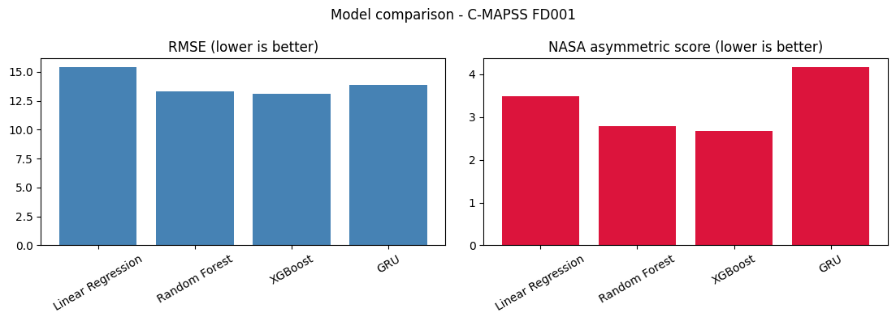
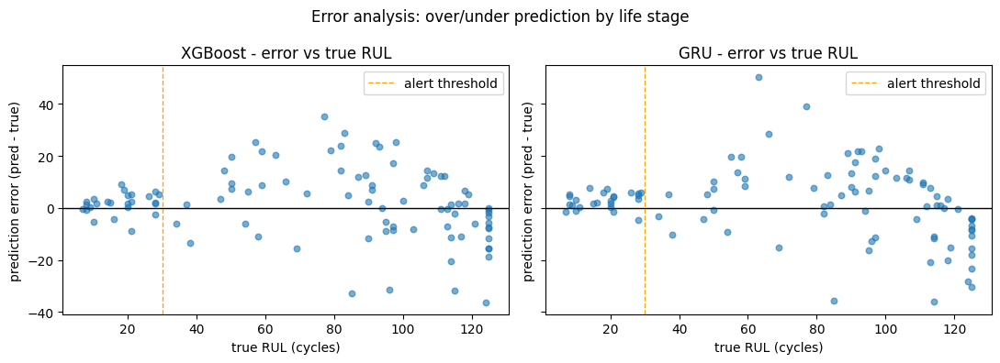
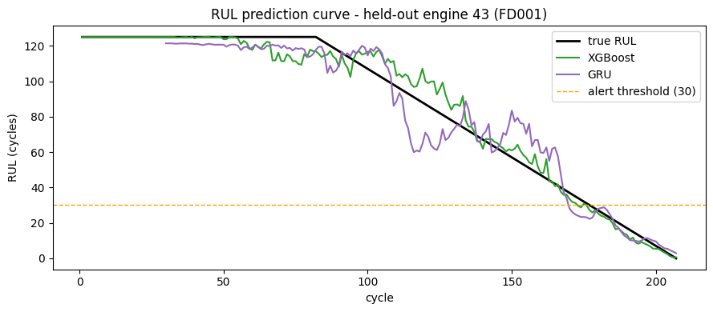

# Aircraft Engine Predictive Maintenance - Remaining Useful Life (RUL)

Predict the **Remaining Useful Life** of a turbofan aircraft engine from
multivariate sensor time-series, using the NASA **C-MAPSS** dataset. Two
modeling approaches are compared end-to-end:

1. **Engineered features + classical ML** (Linear Regression, Random Forest, XGBoost)
2. **Deep sequence model** (GRU/LSTM) trained directly on raw windowed sensor sequences

Both are scored with **RMSE** and the **NASA asymmetric scoring function**, which
penalizes *late* predictions (predicting failure after it happens) more than
*early* ones — because a late maintenance action can mean an in-flight failure.

---

## Problem statement

Turbofan engines degrade over time under varying operating conditions. Given a
run of 21 sensor channels (temperature, pressure, speed, etc.) plus 3
operational settings, we want to estimate how many flight cycles remain before
failure, so maintenance can be scheduled *before* an unplanned outage - and
flagged the moment a pre-defined action threshold is crossed.

## Dataset

**C-MAPSS (Commercial Modular Aero-Propulsion System Simulation)** - NASA
Prognostics Center of Excellence Data Repository.

- **Citation**: A. Saxena and K. Goebel (2008). *"Turbofan Engine Degradation
  Simulation Data Set"*, NASA Prognostics Data Repository, NASA Ames Research
  Center, Moffett Field, CA.
- **Download**: https://www.nasa.gov/intelligent-systems-division/discovery-and-systems-health/pcoe/pcoe-data-set-repository/
  (official ZIP: `https://phm-datasets.s3.amazonaws.com/NASA/6.+Turbofan+Engine+Degradation+Simulation+Data+Set.zip`)

Four subsets:

| Subset | Operating conditions | Fault modes | Train engines | Test engines |
|--------|---------------------|-------------|---------------|--------------|
| FD001  | 1                    | 1           | 100           | 100          |
| FD002  | 6                    | 1           | 260           | 259          |
| FD003  | 1                    | 2           | 100           | 100          |
| FD004  | 6                    | 2           | 249           | 248          |

This project treats **FD001 as the primary subset**; FD002–FD004 are handled by
the same pipeline (per-condition normalization) as stretch goals.

## Pipeline

```
data/raw/*.txt
      │  data_loader.py
      ▼
┌─────────────────────────────────────────────────────────────┐
│ 1. EDA            constant-sensor detection, drift, corr     │
│ 2. Features       piecewise RUL target, rolling stats,       │
│                   degradation trends, per-condition norm.    │
│ 3. Split          by engine UNIT (no cross-engine leakage)   │
└──────────────────────────────┬──────────────────────────────┘
                               │
        ┌──────────────────────┴──────────────────────┐
        ▼                                              ▼
  engineered features                          raw sensor windows
  (252 dims / cycle)                           (window=30 × 14 sensors)
        │                                              │
  LinearRegression                                 GRU / LSTM
  RandomForest                                     (PyTorch)
  XGBoost                                               │
        └──────────────────────┬───────────────────────┘
                               ▼
                    RMSE + NASA score
                    error analysis + alert layer
                               ▼
                    Streamlit demo (live RUL curve)
```

Key design decisions:

- **Leakage-free split**: train/val/test are split by *engine unit*, never by
  cycle, so an engine's entire life history lives in exactly one partition.
- **Piecewise-linear target**: RUL is capped at 125 cycles, so the flat healthy
  early-life segment does not dominate the regression.
- **`life_fraction` is deliberately excluded** from model features: it
  normalizes cycle by total engine life, which is unknowable at inference time.
- **Per-condition normalization** (`ConditionNormalizer`) clusters the six
  operating regimes of FD002/FD004 and z-scores sensors within each regime.

## Results (FD001)

Final evaluation is on the official test set (`test_FD001.txt` vs `RUL_FD001.txt`),
with both predictions and truth clipped to `[0, 125]` (the piecewise cap).
Models were tuned on an 85/15 unit-level train/val split (seed = 42).

| Model             | RMSE ↓ | NASA score ↓ |
|-------------------|-------:|-------------:|
| Linear Regression | 15.39  | 3.48         |
| Random Forest     | 13.33  | 2.79         |
| **XGBoost**       | **13.14** | **2.68** |
| GRU               | 13.91  | 4.16         |



**Takeaways**

- Gradient-boosted trees on engineered features are the best performer, and
  notably better on the *NASA score* than the GRU (2.68 vs 4.16) - they make
  fewer large **late** predictions.
- A vanilla GRU on raw sequences is competitive on RMSE (13.91) but tends to
  over-estimate RUL more often, which the asymmetric score punishes.
- On a dataset this small, hand-crafted features still beat a raw-sequence
  network; the sequence model wins on expressiveness only with more data / more
  sophisticated architectures (attention, CNN-LSTM hybrids).

### Error analysis



Both models **over-predict RUL slightly more often than they under-predict**
(~60% over-estimation, mean bias +1.7–2.0 cycles). Error is largest in the
**mid-life regime (true RUL 50–100)**, where the degradation signal is still
subtle, and smallest near end-of-life (RUL < 30), where the sensors have clearly
diverged.



The live RUL curve (held-out engine) shows both models tracking the true
degradation toward failure, crossing the 30-cycle alert threshold in time.

## Repository structure

```
rul-cmapss/
├── data/            raw + processed (gitignored) + small committed sample
├── notebooks/       01_eda.ipynb (executed, with figures)
├── src/             data_loader.py, features.py, models.py, datasets.py,
│                    evaluate.py, inference.py, train.py, config.py, seeds.py
├── app/             streamlit_app.py
├── scripts/         download_data.py, make_sample.py, report.py
├── tests/           pytest (data loading, features, evaluation)
├── models/          saved artifacts (gitignored)
├── reports/         results table + figures
├── README.md
├── requirements.txt
├── .gitignore
└── LICENSE
```

## How to run locally

```bash
# 1. Create and activate a virtual environment
python -m venv .venv
.venv\Scripts\activate          # Windows  (use `source .venv/bin/activate` on Unix)

# 2. Install dependencies
pip install -r requirements.txt

# 3. Download the dataset
python scripts/download_data.py

# 4. Run tests
pytest -q

# 5. Train models and evaluate (FD001)
python -m src.train --fd 1

# 6. Regenerate the results table + figures
python scripts/report.py --fd 1

# 7. Launch the demo
streamlit run app/streamlit_app.py
```

For the other subsets (multi-condition / multi-fault):

```bash
python -m src.train --fd 2     # FD002 (6 conditions, 1 fault mode)
python -m src.train --fd 4     # FD004 (6 conditions, 2 fault modes)
```

## Reproducibility

- Python 3.11; pinned dependencies in `requirements.txt`.
- Global seed `SEED = 42` (`src/seeds.py`) controls the split, sklearn/xgboost
  RNG, torch RNG and any KMeans initialisation.
- The unit-level split is deterministic (`src/features.split_by_unit`).

## Alert-threshold layer

A maintenance alert fires whenever `predicted RUL < threshold` (default 30
cycles). `src/evaluate.alert_metrics` reports precision/recall/F1 of the alert,
and the Streamlit app visualises the crossing point on the live RUL curve.

## Limitations & future work

- **Small, synthetic dataset**: FD001 has only 100 engines; results should not
  be over-interpreted. Real-world data would be larger, noisier and censored.
- **Piecewise cap**: clipping RUL at 125 discards fine-grained early-life
  differences (standard in C-MAPSS literature, but a known approximation).
- **Final models** are trained on the 85-engine tuning split for a fair
  sequence-vs-baseline comparison; retraining on 100% of training data (and
  evaluating on the official set) is a trivial follow-up.
- **Sequence architecture**: a plain GRU was used; attention, CNN-LSTM hybrids,
  and ensembling typically improve the score further.
- **Uncertainty**: point estimates only. Quantifying prediction uncertainty
  (e.g., MC-dropout or quantile regression) would make the alert layer far more
  defensible in safety-critical aerospace settings.
- **Multi-condition subsets** (FD002–FD004) share the pipeline but were not the
  focus; per-condition normalization should be validated more deeply there.

## License

MIT — see [LICENSE](LICENSE).
